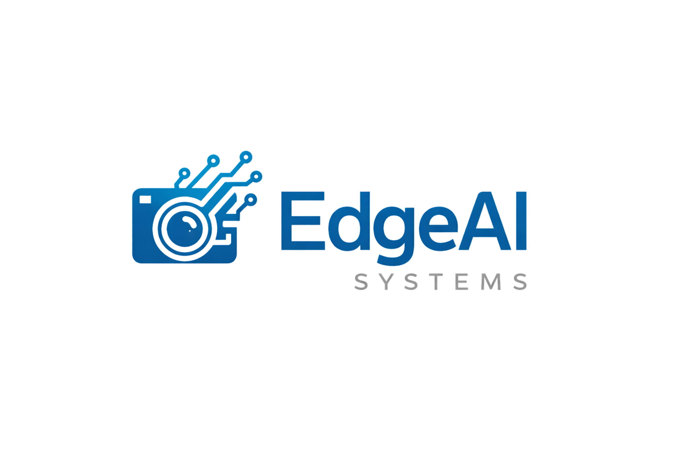

<p align="center">
  
</p>

<p align="center">
⚡ Auto-label images in seconds using YOLO — stop drawing bounding boxes manually
</p>

<p align="center">
  
  
  
  
  
</p>

---

EdgeAI Labeling is a fast and simple data annotation tool designed for real-world computer vision applications such as **vehicle detection**, **license plate recognition**, and **smart parking systems**.

Built for developers who want **speed, automation, and clean workflow**.

---

## 💡 Why EdgeAI Labeling?

- ⚡ Faster than traditional labeling tools (manual → AI-assisted)
- ⚡ Lightweight compared to heavy tools like CVAT
- 🎯 Designed for real-world use (parking, traffic, ANPR)
- 🧠 Built for developers who want speed and automation

---

## 🎬 Demo

### 🔥 Auto Labeling


### 🎯 Manual Labeling


---
### 🆚 Manual vs Auto

- Manual labeling: minutes per image
- Auto labeling: seconds per image ⚡
---
## 💬 What users say

>"Finally some automation for labels" 🔥

---
## ⚡ Try it in 30 seconds

1. Start backend
2. Upload an image
3. Click AUTO
4. Done 🎯

---
## ✨ Features

- 🧠 Auto labeling using YOLOv8
- 📦 Export in YOLO format (ready for training)  
  > ⚠️ Note: Please split your dataset into **train / val / test** before training your model.
- 🖱️ Multi-object bounding box labeling
- ⚡ Fast image navigation (next / prev)
- 🎯 ROI-ready (easy to extend)
- 🧩 Clean and minimal UI

## 🤔 Why not CVAT / Label Studio?

Most existing tools are powerful but often too heavy for quick iteration.

- ⚡ Much lighter setup
- 🎯 YOLO-focused workflow
- 🚀 Faster for small/medium datasets
- 🧠 Built-in auto labeling (not just manual)

> ⚡ Designed for speed, not complexity.

## 🎯 Use Cases

* 🚗 Smart Parking Systems
* 📸 Traffic Monitoring
* 🔍 License Plate Recognition
* 🧪 Custom Dataset Labeling

---

## 🏗️ Project Structure

```
edgeai-labeling/
├── backend/        # FastAPI + YOLO inference
├── frontend/       # Labeling UI
├── docs/           # Demo images & assets
├── docker-compose.yml
└── README.md
```

---

## ⚙️ Installation (Local Setup)

### 1. Clone repository

```bash
git clone https://github.com/edgeai-systems/edgeai-labeling.git
cd edgeai-labeling
```

---

## 🧠 Backend Setup

### Option 1: Using `venv`

```bash
cd backend
python -m venv venv
```

Activate:

**Windows**

```bash
venv\Scripts\activate
```

**Linux / Mac**

```bash
source venv/bin/activate
```

---

### Option 2: Using Conda (recommended for GPU)

```bash
cd backend
conda create -n edgeai python=3.10 -y
conda activate edgeai
```

---

### Install dependencies

```bash
pip install -r requirements.txt
```

---

## ⚡ GPU Support (Optional)

If you want to run inference with GPU, you need to install a CUDA-compatible version of PyTorch manually.

👉 Example (CUDA 12.1):

```bash
pip install torch torchvision --index-url https://download.pytorch.org/whl/cu121
```

⚠️ Notes:

* Make sure your **CUDA version matches your system**
* Docker / local environment must support NVIDIA GPU
* If not configured properly → the app will fallback to CPU

---

### Run backend
```bash
mkdir backend/datasets
cd backend
uvicorn main:app --reload --host 0.0.0.0 --port 8000
```

👉 UI: http://localhost:8000/ <br>
👉 API docs: http://localhost:8000/docs


## 🔗 API Configuration

Edit `frontend/src/api.js`:

```javascript
const API_URL = "http://localhost:8000";
```

---

## 🧠 Auto Labeling Flow

1. Upload image
2. Click **AUTO**
3. System will:

   * Detect objects using YOLO
   * Generate bounding boxes
   * Map classes automatically

---

## 📦 YOLO Export Format

```
class_id x_center y_center width height
```

Compatible with:

* YOLOv5
* YOLOv8 (Ultralytics)

---

## ⚠️ Notes

* Ensure your YOLO model path is configured correctly
* First inference may take longer due to model loading
* CPU is sufficient for testing (GPU optional)

---
## ☕ Support this project

>If this tool saves you hours of manual labeling, consider buying me a coffee ☕  
Even a small support helps keep this project alive 🚀
---
## 🌍 International

* PayPal: https://paypal.me/anhpnh
---
## 🇻🇳 Vietnam (MoMo / Bank QR)

Scan QR below:


---

## 💡 Roadmap

* [ ] Batch auto labeling (folder)
* [ ] Polygon segmentation
* [ ] Multi-user support
* [ ] Model selection UI
* [ ] Cloud sync

---

## 🤝 Contributing

Pull requests are welcome.
For major changes, please open an issue first.

---

## ⭐ Support

If you find this project useful, give it a ⭐ on GitHub!

---

## 📄 License

MIT License
